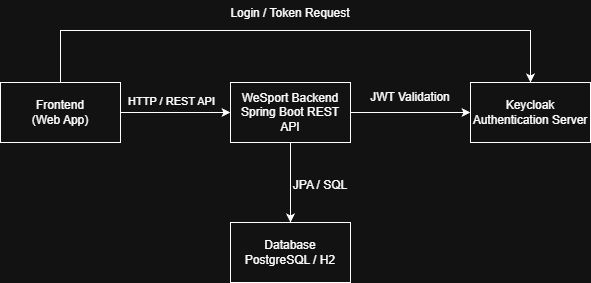

# WeSport
[](https://github.com/saveriobutright/WeSport/actions/workflows/full-stack-ci.yml)
[](LICENSE)

WeSport is a full-stack web platform for creating, discovering and joining amateur sports events.

The project demonstrates REST API design, JWT-based authentication, role-based authorization, relational data modelling and concurrent event participation management.

> Payments are simulated for demonstration purposes. No real payment provider or financial transaction is involved.

## Features

- Browse public sports events
- Create, update and delete events
- Join or leave an event with a selected player role
- Manage event capacity and participation
- View organized and joined events
- Simulate facility payments
- Manage sports and locations
- Authenticate users with Keycloak
- Restrict organizer functionality through role-based authorization

## Technology stack

### Backend

- Java 17
- Spring Boot 3.5
- Spring Security
- Spring Data JPA
- OAuth 2.0 Resource Server
- Flyway
- Maven

### Frontend

- Angular 20
- TypeScript 5.9
- RxJS
- Keycloak JS

### Infrastructure

- PostgreSQL 15
- Keycloak 24
- Docker Compose

## Architecture

WeSport uses a layered backend architecture:

```text
Controller → Service → Repository → PostgreSQL
     ↓
    DTO
```

The Angular client communicates with the backend through REST APIs and obtains JWT access tokens from Keycloak.



## Project structure

```text
.
├── backend/wesport-backend/   Spring Boot REST API
├── frontend/                  Angular application
├── docker/                    PostgreSQL and Keycloak configuration
├── architecture.png           Architecture diagram
├── start-all.bat              Windows launcher
└── start-all.ps1              PowerShell startup script
```

## Getting started

### Requirements

Install the following software:

- Docker Desktop
- Java 17
- Node.js and npm
- Git

### Quick start on Windows

From the project root, run:

```powershell
.\start-all.bat
```

The script starts PostgreSQL and Keycloak through Docker Compose, then launches the backend and frontend in separate PowerShell windows.

### Manual startup

#### 1. Start PostgreSQL and Keycloak

From the project root:

```bash
docker compose -f docker/docker-compose.yml up -d
```

#### 2. Start the backend

On Windows:

```powershell
cd backend/wesport-backend
.\mvnw.cmd spring-boot:run
```

On Linux or macOS:

```bash
cd backend/wesport-backend
./mvnw spring-boot:run
```

#### 3. Start the frontend

In another terminal:

```bash
cd frontend
npm install
npm start
```

## Local services

| Service | Address |
|---|---|
| Angular frontend | http://localhost:4200 |
| Spring Boot API | http://localhost:8081 |
| Keycloak | http://localhost:8080 |
| PostgreSQL | localhost:5432 |

## Authentication and roles

The Docker configuration imports the `wesport` realm and the `wesport-angular` client automatically.

For local development, the Keycloak administrator credentials are:

```text
Username: admin
Password: admin
```

Open the Keycloak administration console at:

```text
http://localhost:8080/admin
```

The application uses two realm roles:

- `USER`: standard authenticated user
- `ORGANIZER`: user allowed to create and manage events

Create or register a user and assign the appropriate realm role through the Keycloak administration console.

> The included credentials are intended only for local development and must be changed in any deployed environment.

## Environment variables

The backend supports the following variables:

| Variable | Default value |
|---|---|
| `SERVER_PORT` | `8081` |
| `DB_URL` | `jdbc:postgresql://localhost:5432/wesport` |
| `DB_USERNAME` | `wesport` |
| `DB_PASSWORD` | `wesport` |
| `KEYCLOAK_ISSUER_URI` | `http://localhost:8080/realms/wesport` |

Docker credentials can also be overridden through environment variables before starting Docker Compose.

## Testing

With PostgreSQL and Keycloak running, execute the backend tests:

```bash
cd backend/wesport-backend
./mvnw test
```

Execute the Angular tests with:

```bash
cd frontend
npm test -- --watch=false
```

Build the frontend for production with:

```bash
npm run build
```

## API overview

Public catalog endpoints are available under:

```text
/api/public
```

Authenticated event operations are available under:

```text
/api/events
```

User-specific event collections are available under:

```text
/api/events/mine
```

## License

This project is distributed under the [MIT License](LICENSE).

## Author

**Saverio Polito**

- [GitHub](https://github.com/saveriobutright)
- [LinkedIn](https://www.linkedin.com/in/saverio-polito-a407a53ba)